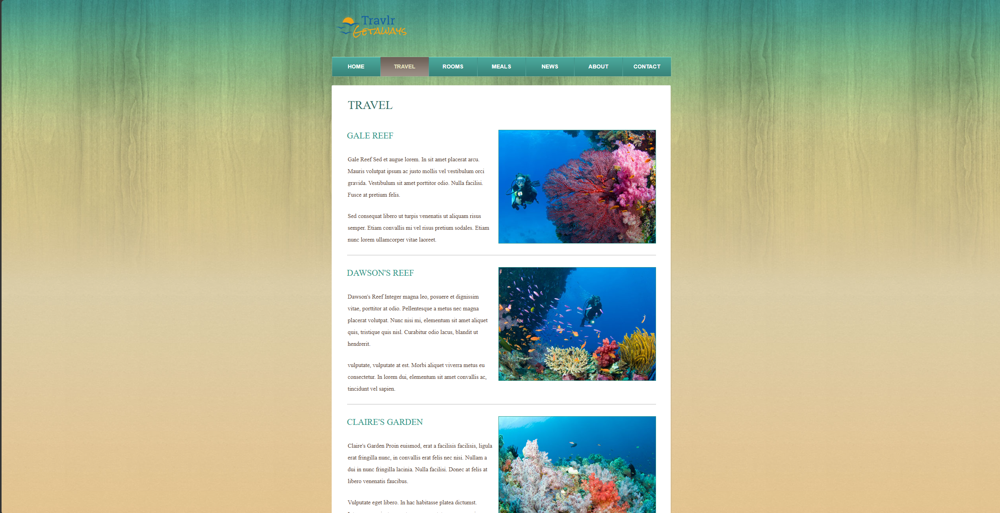
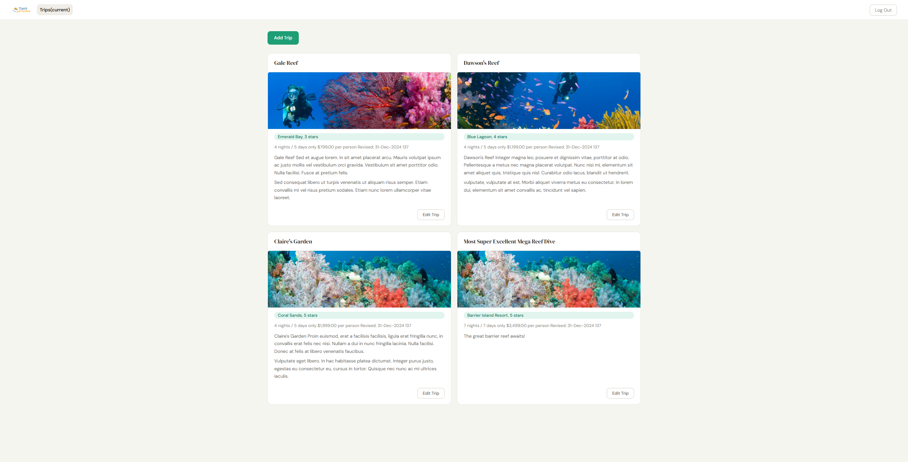
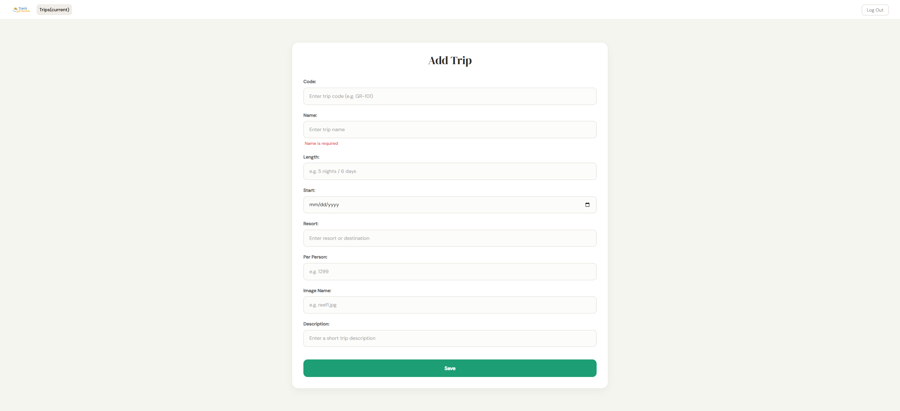
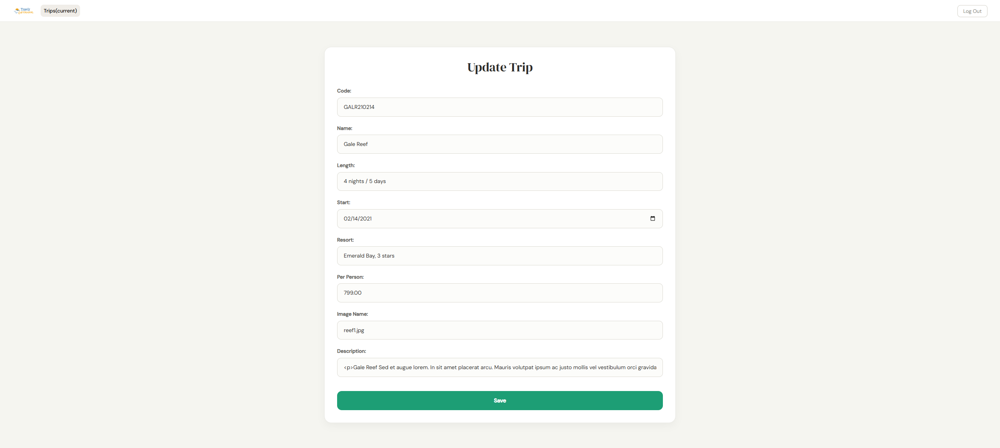

# Travlr Getaways - Full Stack Travel Booking App

A full-stack travel booking web application built with the **MEAN stack** (MongoDB, Express, Angular, Node.js). Features a customer-facing site for browsing trips and a secure admin SPA for managing trip data in real time.

> Built as part of CS-465: Full Stack Development at Southern New Hampshire University


## Screenshots

### Customer-Facing Trip Listing



### Admin Dashboard - Manage Trips



### Add and Edit Trip Forms

#### Add Trip


#### Edit Trip



## Features

- Browse travel packages with pricing, images, and trip details
- Manage trips through an Angular admin dashboard
- Create, update, and delete trips with REST API endpoints
- Protect admin routes using JWT authentication
- Update UI data instantly with Angular data binding
- Use reusable components and centralized API services


## Architecture

The app is split into two frontends sharing one backend:

```
                                      ┌─────────────────────────┐        ┌──────────────────────────┐
                                      │   Customer Frontend     │        │     Admin SPA (Angular)  │
                                      │   Express + HTML/CSS    │        │   Components + Services  │
                                      └────────────┬────────────┘        └────────────┬─────────────┘
                                                   │                                  │
                                                   └──────────────┬───────────────────┘
                                                                  │  RESTful API (JSON)
                                                        ┌─────────▼──────────┐
                                                        │  Node.js + Express │
                                                        │  Routes, Auth, API │
                                                        └─────────┬──────────┘
                                                                  │
                                                        ┌─────────▼──────────┐
                                                        │      MongoDB       │
                                                        │  Trips, Users DB   │
                                                        └────────────────────┘
```

## Why I Used the MEAN Stack

- MongoDB provides a flexible document model for trip and user data
- Express handles routing and backend middleware
- Angular powers the admin dashboard with reusable components and dynamic UI updates
- Node.js allows the entire application to use JavaScript across the frontend and backend


## Technologies

| Layer | Technology |
|---|---|
| Frontend (customer) | Express HTML, JavaScript, CSS |
| Frontend (admin) | Angular, TypeScript |
| Backend | Node.js, Express.js |
| Database | MongoDB |
| Auth | JWT (JSON Web Tokens) |
| Testing | Postman, MongoDB Compass |
| Version Control | Git, GitHub |


## 📡 API Endpoints

| Method | Endpoint | Auth Required | Description |
|---|---|---|---|
| GET | `/api/trips` | No | Fetch all trips |
| GET | `/api/trips/:tripCode` | No | Fetch single trip |
| POST | `/api/trips` | ✅ Yes | Create a new trip |
| PUT | `/api/trips/:tripCode` | ✅ Yes | Update a trip |
| DELETE | `/api/trips/:tripCode` | ✅ Yes | Delete a trip |
| POST | `/api/login` | No | Authenticate user, returns JWT |
| POST | `/api/register` | No | Register new admin user |


## Getting Started

### Prerequisites

- [Node.js](https://nodejs.org/) v16+
- [MongoDB](https://www.mongodb.com/) (local install or [MongoDB Atlas](https://www.mongodb.com/atlas))
- [Angular CLI](https://angular.io/cli) — `npm install -g @angular/cli`

### Installation

**1. Clone the repository**
```bash
git clone https://github.com/SamimDW/your-repo-name.git
cd your-repo-name
```

**2. Install backend dependencies**
```bash
npm install
```

**3. Configure environment variables**

Create a `.env` file in the root directory:
```env
MONGODB_URI=mongodb://localhost:27017/travlr
JWT_SECRET=your_secret_key_here
PORT=3000
```

**4. Seed the database** *(if a seed file is included)*
```bash
npm run seed
```

**5. Start the backend server**
```bash
npm start
```
> Server runs at `http://localhost:3000`

**6. Install and run the Angular admin app**
```bash
cd app_admin
npm install
ng serve
```
> Admin SPA runs at `http://localhost:4200`


## Authentication

The admin SPA is protected by JWT authentication. To access trip management:

1. Navigate to `http://localhost:4200`
2. Register a new admin account or log in with existing credentials
3. On successful login, a JWT is stored and automatically attached to all protected API requests
4. Unauthorized requests to protected routes return `401 Unauthorized`


## Testing

API endpoints were tested with **Postman**. Key test cases included:

- `GET /api/trips` returns all trips with correct structure
- `PUT /api/trips/:tripCode` rejects requests without a valid JWT
- `POST /api/trips` validates required fields and rejects malformed input
- Invalid credentials on `/api/login` return `401` with no token issued


## Key Learnings

- Architecting a full-stack application where two separate frontends share one API
- Refactoring repeated HTML/JS logic into reusable Angular components and services
- Implementing stateless authentication with JWT across protected routes
- Understanding the tradeoffs between server-rendered pages (Express/HTML) and a SPA (Angular)
- Practical experience with RESTful API design, Git workflows, and Agile development


## Author

**Samim Dawood**
- GitHub: [@SamimDW](https://github.com/SamimDW)
- LinkedIn: [samim-fnu](https://www.linkedin.com/in/samim-fnu/)


## 📄 License

This project was developed for academic purposes at Southern New Hampshire University (CS-465).
